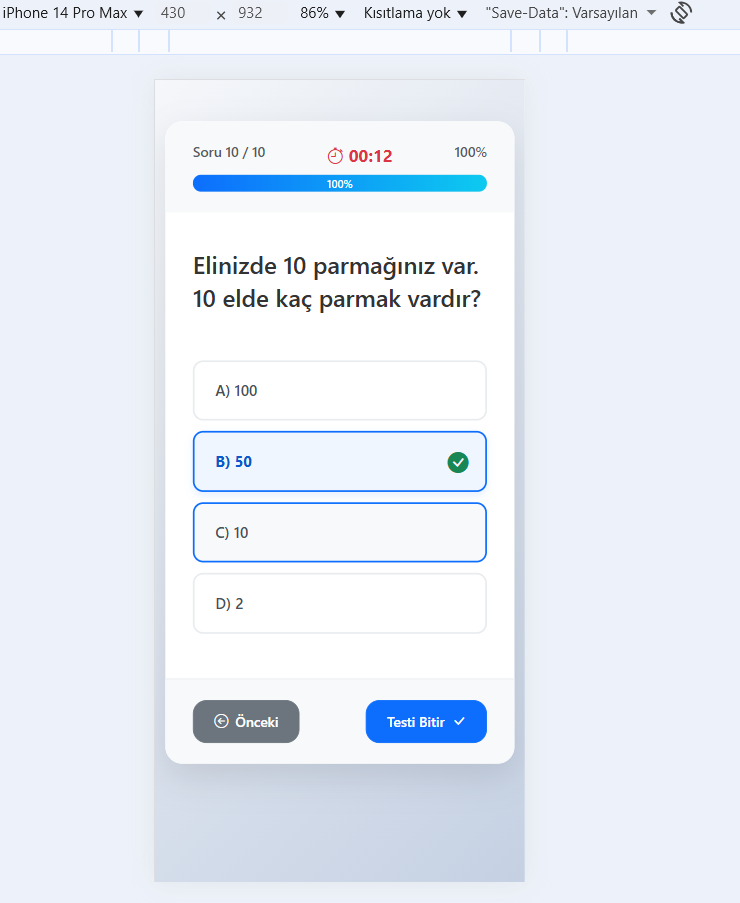

# Quiz-App-js
A dynamic quiz application built with Bootstrap 5 and JavaScript, featuring a 15-min timer and questions loaded from a JSON file.
# Bootstrap 5 ile Dinamik Quiz Uygulaması

Bu proje, modern web teknolojileri kullanılarak oluşturulmuş, tam özellikli ve duyarlı (responsive) bir web tabanlı quiz uygulamasıdır. Kullanıcı dostu bir arayüze, zamanlayıcıya ve harici bir JSON dosyasından dinamik olarak çekilen sorulara sahiptir.


---

## 🚀 Temel Özellikler

Bu quiz uygulaması, basit bir soru-cevap uygulamasından daha fazlasıdır:

* **Modern Arayüz:** Bootstrap 5 kullanılarak şık, duyarlı ve mobil uyumlu bir tasarım.
* **Dinamik Soru Yükleme:** Sorular, `fetch` API kullanılarak harici bir `sorular.json` dosyasından asenkron olarak çekilir. Bu, soruları değiştirmek için HTML'e dokunma ihtiyacını ortadan kaldırır.
* **15 Dakika Zaman Sınırı:** Kullanıcının testi tamamlamak için 15 dakikası vardır. Süre, ekranın üst kısmında anlık olarak gösterilir.
* **Süre Bitti Uyarısı:** Süre dolduğunda, ekranı kilitleyen ve kullanıcıyı sonuçları göndermeye zorlayan bir Bootstrap Modalı (açılır pencere) görünür.
* **Tam Navigasyon:** Kullanıcılar, `Önceki Soru` ve `Sonraki Soru` butonları ile sorular arasında serbestçe gezinebilir ve cevaplarını değiştirebilirler.
* **Zorunlu Olmayan Cevaplar:** Kullanıcılar, bir soruyu cevaplamadan "Sonraki Soru" butonuna basarak soruları boş bırakabilirler.
* **İnteraktif Seçenekler:** Seçenekler, tıklandığında anında görsel geri bildirim (vurgu ve onay ikonu) veren kartlar şeklindedir.
* **Sonuç Ekranı:** Test bittiğinde veya süre dolduğunda, kullanıcının toplam doğru sayısı hesaplanır ve bir başarı ekranında gösterilir.
* **Kontrol Paneli (Dashboard):** Kullanıcıları, quiz'i başlatabilecekleri veya proje hakkında bilgi alabilecekleri şık bir ana menü (`dashboard.html`) karşılar.

---

## 🛠️ Kullanılan Teknolojiler

* **HTML5:** Uygulamanın ana yapısı.
* **CSS3:** Özel stiller, modern `box-shadow`, `gradient` ve `:has()` seçicisi ile interaktif vurgular.
* **Bootstrap 5:** Hızlı ve duyarlı tasarım için ana framework (Kartlar, Modallar, Grid Sistemi, İlerleme Çubuğu).
* **Bootstrap Icons:** Arayüzdeki ikonlar için.
* **JavaScript (ES6+):**
    * Tüm quiz mantığı ve DOM manipülasyonu.
    * **Fetch API:** `sorular.json` dosyasını okumak için.
    * **setInterval:** 15 dakikalık zamanlayıcıyı çalıştırmak için.
    * **Array Metotları:** Cevapları bir dizide saklamak ve skoru hesaplamak için.
* **JSON:** Soruların, seçeneklerin ve doğru cevapların depolandığı veri formatı.


---

## 🏁 Başlarken

Bu projeyi yerel makinenizde çalıştırmak için aşağıdaki adımları izleyin.

### ⚠️ Önemli Uyarı: Yerel Sunucu (Local Server)

Bu proje, `fetch` API kullanarak `sorular.json` dosyasını okur. Tarayıcı güvenlik politikaları (CORS), `file:///` protokolü üzerinden (yani `dashboard.html` dosyasına çift tıklayarak) bu tür isteklere izin vermez.

**Bu nedenle, projeyi mutlaka bir yerel sunucu (local server) üzerinden çalıştırmalısınız.**

### Kurulum Adımları

1.  Bu repoyu klonlayın (veya dosyaları ZIP olarak indirin):
    ```bash
    git clone [https://github.com/mucahitcigci/Quiz-App-js](https://github.com/mucahitcigci/Quiz-App-js)
    ```

2.  Proje klasörüne gidin:
    ```bash
    cd Quiz-App-js
    ```

3.  Bir yerel sunucu başlatın. En kolay yolu VS Code kullanıyorsanız **"Live Server"** eklentisini kurmaktır.
    * VS Code'da `dashboard.html` dosyasına sağ tıklayın.
    * **"Open with Live Server"** seçeneğine tıklayın.

4.  Tarayıcınız otomatik olarak `http://127.0.0.1:5500/dashboard.html` gibi bir adreste açılacaktır ve uygulama sorunsuz çalışacaktır.

---

## 📁 Dosya Yapısı
├── 📄 dashboard.html (Uygulamanın ana giriş sayfası - Kontrol Paneli) 
├── 📄 quiz.html (Asıl quiz'in gerçekleştiği sayfa) 
├── 📄 quiz.js (Zamanlayıcı, fetch, navigasyon ve skor mantığının tamamı) 
├── 📄 sorular.json (Quiz soruları, seçenekleri ve cevap anahtarı) 
└── 📄 README.md
